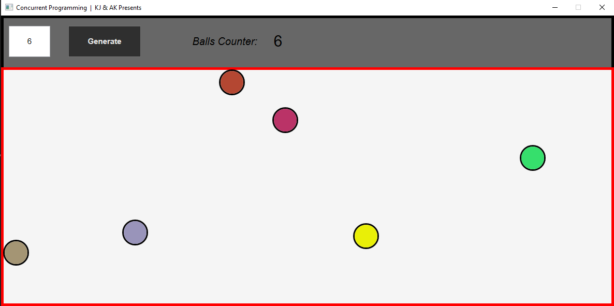

<br/>
<p align="center">
  <h1 align="center">Concurrent programming</h1>
</p>

    

## Table Of Contents

* [About the Project](#about-the-project)
* [Built With](#built-with)
* [Getting Started](#getting-started)
  * [Prerequisites](#prerequisites)
  * [Installation](#installation)
* [Usage](#usage)
* [Roadmap](#roadmap)
* [Contributing](#contributing)
* [License](#license)
* [Authors](#authors)
* [Acknowledgements](#acknowledgements)

## About The Project



Our task was to create a program of balls moving on the screen in C#, using asynchronous and concurrent programming techniques.
The project is that the user selects the number of balls to generate and presses the button, then the balls are generated in random places and their task is to move and bounce in a realistic way from the barriers and themselves.

Here's why:

* We wanted to learn more and test the concurrency programming ourselves.
* Using the simple idea of bouncing balls to practice programming, but in an interesting and new way for us.
* Watching the balls bounce off each other is really satisfying: try it for yourself ;-)

Despite such a simple idea, it might seem that the project will be trivial, however it turned out to be an interesting challenge

A list of commonly used resources that we find helpful are listed in the acknowledgements.

## Built With

The idea was to make a program in C# using the MVVM pattern to connect the data with the view. Finally, our project is divided into 3 layers: data, logic and presentation. And the presentation layer itself is made according to the MVVM pattern and is divided into: model, viewmodel, view. The next step was to implement multi-threading. We wanted each ball to be a separate thread and move independently. We used the critical section for data and logic to avoid various problems. we implement reactive and interactive user-computer interaction. Our graphical user interface (GUI) is made using XAML. In addition also Dependency Injections and asynchronous programming is used.

## Getting Started

This is an example of how you may give instructions on setting up your project locally.
To get a local copy up and running follow these simple example steps.

### Prerequisites

This is an example of how to list things you need to use the software and how to install them.

* npm

```sh
npm install npm@latest -g
```

### Installation

1. Get a free API Key at [https://example.com](https://example.com)

2. Clone the repo

```sh
git clone https://github.com/your_username_/Project-Name.git
```

3. Install NPM packages

```sh
npm install
```

4. Enter your API in `config.js`

```JS
const API_KEY = 'ENTER YOUR API';
```

## Usage

Use this space to show useful examples of how a project can be used. Additional screenshots, code examples and demos work well in this space. You may also link to more resources.

_For more examples, please refer to the [Documentation](https://example.com)_

## Roadmap

See the [open issues](https://github.com/ShaanCoding/ReadME-Generator/issues) for a list of proposed features (and known issues).

## Contributing

Contributions are what make the open source community such an amazing place to be learn, inspire, and create. Any contributions you make are **greatly appreciated**.
* If you have suggestions for adding or removing projects, feel free to [open an issue](https://github.com/ShaanCoding/ReadME-Generator/issues/new) to discuss it, or directly create a pull request after you edit the *README.md* file with necessary changes.
* Please make sure you check your spelling and grammar.
* Create individual PR for each suggestion.
* Please also read through the [Code Of Conduct](https://github.com/ShaanCoding/ReadME-Generator/blob/main/CODE_OF_CONDUCT.md) before posting your first idea as well.

### Creating A Pull Request

1. Fork the Project
2. Create your Feature Branch (`git checkout -b feature/AmazingFeature`)
3. Commit your Changes (`git commit -m 'Add some AmazingFeature'`)
4. Push to the Branch (`git push origin feature/AmazingFeature`)
5. Open a Pull Request

## License

See [LICENSE](https://creativecommons.org/publicdomain/zero/1.0/legalcode.pl) for more information.

## Working Group (Authors)

| Name Surname (initials) | GUID                                     |
| ----------------------- | ---------------------------------------- |
| Kacper Jagodziński      | `{44cde337-333b-4960-bd5c-8a18c9b5b97b}` |
| Adam Kruszyński         | `{cb2cfa5a-5396-4921-be82-b7c9f2beec61}` |

## Acknowledgements

* [GithubProject](https://github.com/mpostol/TP)
* [Wiki](https://en.wikipedia.org/wiki/Elastic_collision)
